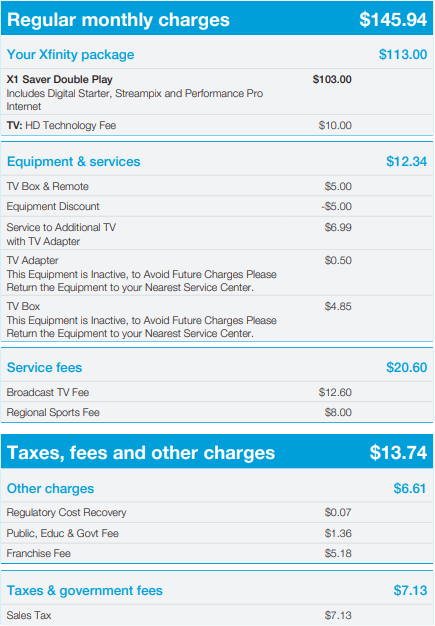

# Xfinity Billing Statement Converter

An application that converts Xfinity billing statements to a spreadsheet.

## About the Project

This application is written in Python. It reads Xfinity billing statements in a folder and converts all charges to a single spreadsheet. By doing so, the changes to billings are easily observable.

If you ever wonder how your Xfinity bills have gotten higher and higher, use this application to find out.

## Getting Started

[todo] release an executable

## Author
Created by Justin Liu
